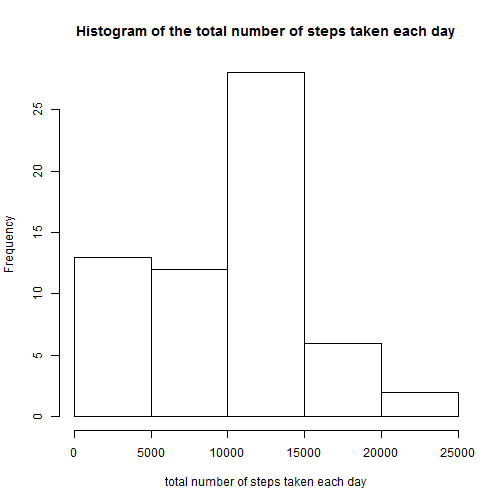
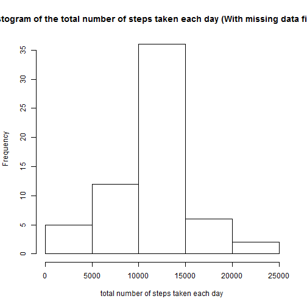
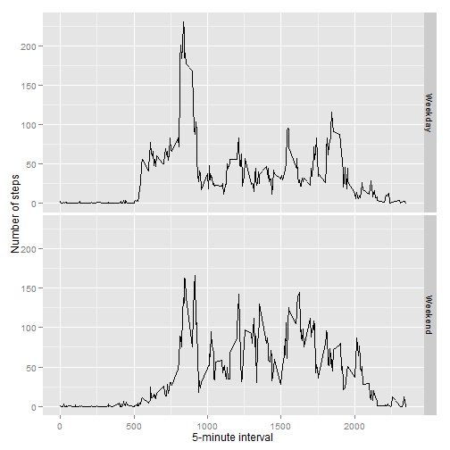

Reproducible Research: Peer Assessment 1
=========================================

## Loading and preprocessing the data


```r
unzip(zipfile = "activity.zip")
data <- read.csv("activity.csv")
```

## What is mean total number of steps taken per day?

```r
library(ggplot2)

## totalPerDay <- tapply(data$steps, data$date, FUN=sum, na.rm=TRUE)
aggrData <- aggregate(data$steps, by=list(data$date), FUN=sum, na.rm=TRUE)
colnames(aggrData) <- c("Date","steps")
## qplot(x=Date, data=aggrData, geom="histogram")

hist(aggrData$steps, main = paste("Histogram of the total number of steps taken each day"),
     xlab = "total number of steps taken each day")
```

 

```r
## mean
mean(aggrData$steps, na.rm = TRUE)
```

```
## [1] 9354
```

```r
## median
median(aggrData$steps,na.rm = TRUE)
```

```
## [1] 10395
```

## What is the average daily activity pattern?
Make a time series plot of the 5-minute interval (x-axis) and the average number of steps taken, averaged across all days (y-axis)

```r
averages <- aggregate(x = list(steps = data$steps),
                      by = list(interval = data$interval), 
                      FUN = mean, na.rm = TRUE)
## Time Series Plot
ggplot(data = averages, aes(x = interval, y = steps)) +
        geom_line() + xlab("5-minute interval") + 
        ylab("average number of steps taken")
```

 

Which 5-minute interval, the 5-minute interval contains the maximum number of steps?

```r
maxSteps <- max(averages$steps)

averages[averages$steps==maxSteps,]
```

```
##     interval steps
## 104      835 206.2
```


## Imputing missing values
1. Calculate and report the total number of missing values in the dataset (i.e. the total number of rows with NAs)

```r
nrow(data[is.na(data$steps),])
```

```
## [1] 2304
```

```r
table(is.na(data$steps))
```

```
## 
## FALSE  TRUE 
## 15264  2304
```


2. Use the mean steps for that 5-minute interval to fill in missing value
3. Create a new dataset that is equal to the original dataset but with the missing data filled in.

```r
## mean steps for each interval
meanStep <- aggregate(x = list(steps = data$steps),
                      by = list(interval = data$interval), 
                      FUN = mean, na.rm = TRUE)

fill.value <- function(steps, interval) {
        filled <- NA
        if (!is.na(steps))
                filled <- c(steps) 
        ## is missing
        else filled <- (meanStep[meanStep$interval == interval, "steps"])
        
        return(filled)
        }
filled.data <- data
filled.data$steps <- mapply(fill.value, filled.data$steps, filled.data$interval)

str(data)
```

```
## 'data.frame':	17568 obs. of  3 variables:
##  $ steps   : int  NA NA NA NA NA NA NA NA NA NA ...
##  $ date    : Factor w/ 61 levels "2012-10-01","2012-10-02",..: 1 1 1 1 1 1 1 1 1 1 ...
##  $ interval: int  0 5 10 15 20 25 30 35 40 45 ...
```

```r
str(filled.data)
```

```
## 'data.frame':	17568 obs. of  3 variables:
##  $ steps   : num  1.717 0.3396 0.1321 0.1509 0.0755 ...
##  $ date    : Factor w/ 61 levels "2012-10-01","2012-10-02",..: 1 1 1 1 1 1 1 1 1 1 ...
##  $ interval: int  0 5 10 15 20 25 30 35 40 45 ...
```


4. Make a histogram of the total number of steps taken each day and Calculate and report the mean and median total number of steps taken per day.

```r
aggrData_Filled <- aggregate(filled.data$steps, by=list(filled.data$date), FUN=sum, na.rm=TRUE)
colnames(aggrData_Filled) <- c("Date","steps")
## qplot(x=Date, data=aggrData_Filled, geom="histogram")
hist(aggrData_Filled$steps,
     main = paste("Histogram of the total number of steps taken each day (With missing data filled in)"),
     xlab = "total number of steps taken each day")
```

 

```r
## mean
mean(aggrData_Filled$steps, na.rm = TRUE)
```

```
## [1] 10766
```

```r
## median
median(aggrData_Filled$steps,na.rm = TRUE)
```

```
## [1] 10766
```

The mean and median total number of steps values are higher than before.
Because there are some days with  steps  values `NA` for some  interval . 
The total number of steps taken in such days are set to 0s by default. 
After replacing missing  steps  values with the mean steps of related interval value,
these 0 values are removed from the histogram of total number of steps taken each day.


## Are there differences in activity patterns between weekdays and weekends?
Use the dataset with the filled-in missing values for this part

1. Create a new factor variable in the dataset with two levels – “weekday” and “weekend”

```r
isWeekday <- function(date){
        day <- weekdays(date)
        if (day %in% c("Monday", "Tuesday", "Wednesday", "Thursday", "Friday")) 
                return("Weekday") 
        else if (day %in% c("Saturday", "Sunday")) 
                return("Weekend") 
        else stop("invalid date")

}

filled.data$date <- as.Date(filled.data$date)
filled.data$day <- sapply(filled.data$date, FUN = isWeekday)
```

2. Make a panel plot containing a time series plot 

```r
averages <- aggregate(steps ~ interval + day, data = filled.data, mean)
ggplot(averages, aes(interval, steps)) +
        geom_line() + facet_grid(day ~ .) + 
        xlab("5-minute interval") + ylab("Number of steps")
```

 

