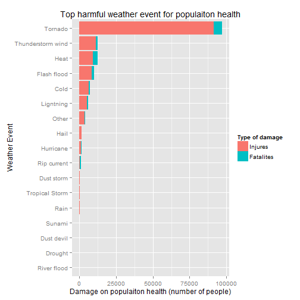
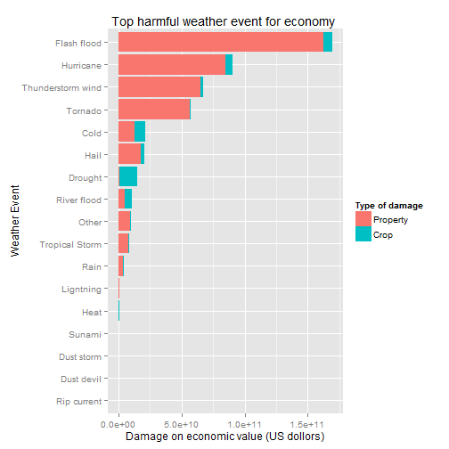

## Synopsis
This report presents an analysis about the impacts of wheather events on the population health and economic. The data is published by the U.S. National Oceanic and Atmospheric Administration's (NOAA) storm database. We found that the tornado is most harmful for population heath, and the flash flood results in greatest loss on economic value.

## Questions

1. Across the United States, which types of events (as indicated in the `EVTYPE` variable) are most harmful with respect to population health?


2. Across the United States, which types of events have the greatest economic consequences?


```r
library(ggplot2)
library(data.table)
```

```
## data.table 1.9.2  For help type: help("data.table")
```


### Data Processing
Data are downloaded and imported in stormdata data frame

```r
fileUrl <- "https://d396qusza40orc.cloudfront.net/repdata%2Fdata%2FStormData.csv.bz2"
if(!file.exists("tempdata.csv.bz2")){
        download.file(fileUrl, destfile = "tempdata.csv.bz2")
}

stormdata <- read.csv("tempdata.csv.bz2", stringsAsFactors = FALSE)
```

7 variables that are relevante for addressing the questions:

- EVTYPE: Name (category) of the weather event.
- FATALITIES: number of cases with harm to human health
- INJURIES: number of cases with harm to human health
- PROPDMG: Coefficient of amount of property damage (USD)
- PROPDMGEXP: magnitude of property damage (thousands (“K”), millions (“M”)
- CROPDMG: Coefficient of amount of crop damage (USD)
- CROPDMGEXP: magnitude of crop damage 

These are extracted for further analysis.

```r
attributes <- c("STATE", "EVTYPE", "FATALITIES", "INJURIES", "PROPDMG", "PROPDMGEXP", 
    "CROPDMG", "CROPDMGEXP")

stormdata <- stormdata[, attributes]
colnames(stormdata) <- c("state", "evtype", "fatalites", "injures", "propdmg", "propdmgexp", 
    "cropdmg", "cropdmgexp")

str(stormdata)
```

```
## 'data.frame':	902297 obs. of  8 variables:
##  $ state     : chr  "AL" "AL" "AL" "AL" ...
##  $ evtype    : chr  "TORNADO" "TORNADO" "TORNADO" "TORNADO" ...
##  $ fatalites : num  0 0 0 0 0 0 0 0 1 0 ...
##  $ injures   : num  15 0 2 2 2 6 1 0 14 0 ...
##  $ propdmg   : num  25 2.5 25 2.5 2.5 2.5 2.5 2.5 25 25 ...
##  $ propdmgexp: chr  "K" "K" "K" "K" ...
##  $ cropdmg   : num  0 0 0 0 0 0 0 0 0 0 ...
##  $ cropdmgexp: chr  "" "" "" "" ...
```

The documentation points out that similar storm events can be listed using different wording e.g. “coastal flood” and “coastal flooding.” This is confirmed by a cursory analysis of EVTYPE levels.

```r
head(levels(as.factor(stormdata$evtype)),20)
```

```
##  [1] "   HIGH SURF ADVISORY"  " COASTAL FLOOD"        
##  [3] " FLASH FLOOD"           " LIGHTNING"            
##  [5] " TSTM WIND"             " TSTM WIND (G45)"      
##  [7] " WATERSPOUT"            " WIND"                 
##  [9] "?"                      "ABNORMAL WARMTH"       
## [11] "ABNORMALLY DRY"         "ABNORMALLY WET"        
## [13] "ACCUMULATED SNOWFALL"   "AGRICULTURAL FREEZE"   
## [15] "APACHE COUNTY"          "ASTRONOMICAL HIGH TIDE"
## [17] "ASTRONOMICAL LOW TIDE"  "AVALANCE"              
## [19] "AVALANCHE"              "BEACH EROSIN"
```


### Data Cleaning
Create a function to cleanup the eventType

```r
deliverEvtUnifiedName <- function(dd) {
    evtMatcher <- data.frame(reg = c("NADO|FUNNEL|WATERSPOUT", "THUNDER|STORM|WIND", 
        "HAIL", "FROST|FREEZ|BLIZZARD|WINTER|COLD|LOW TEMP|RECORD LOW|SNOW|ICE", 
        "HEAT|WARM|RECORD HIGH", "COSTAL STORM", "SUNAMI", "RIP CURRENT", "FLASH FLOOD|FLD|FLOOD", 
        "RIVER FLOOD|URBAN FLOOD", "TROPICAL STORM|TROPICAL", "HURRICANE", "DROUGHT", 
        "DUST STORM", "DUST DEVIL", "RAIN", "LIGHTNING"))
    
    factorId <- c("Tornado", "Thunderstorm wind", "Hail", "Cold", "Heat", "Costal Storm", 
        "Sunami", "Rip current", "Flash flood", "River flood", "Tropical Storm", 
        "Hurricane", "Drought", "Dust storm", "Dust devil", "Rain", "Ligntning")
    
    for (i in 1:nrow(evtMatcher)) {
        indexFit <- grep(evtMatcher[i, "reg"], toupper(dd[, "evtype"]))
        if (length(indexFit) > 0) {
            dd[indexFit, "event"] <- factorId[i]
            
        }
    }
    return(dd)
}
```

Cleanup `evtype`

```r
stormdata$event <- ("-")
# Give each event an unified id factor
stormdata <- deliverEvtUnifiedName(stormdata)
otherIndex <- grep("-", stormdata[, "event"])
stormdata[otherIndex, "event"] <- "Other"
stormdata$event <- as.factor(stormdata$event)

# See the event and number of that
table(stormdata$event)
```

```
## 
##              Cold           Drought        Dust devil        Dust storm 
##             46131              2512               150               429 
##       Flash flood              Hail              Heat         Hurricane 
##             85530            290400              2969               288 
##         Ligntning             Other              Rain       Rip current 
##             15776              9558             12238               777 
##       River flood            Sunami Thunderstorm wind           Tornado 
##               569                20            362662             71531 
##    Tropical Storm 
##               757
```

Calculate the damage value for property and crop. Values can be made by `dmg` and `exp` variable:

- Fomula I : propdmgValue = propdmg * propdmgexp

- Fomula II : cropdmgValue = cropdmg * cropdmgexp 


Create function to caculate the property and crop damage by `dmg` and `exp` variable

```r
deliverActualDmgValue <- function(dd) {
    unit <- data.frame(cha = c("B", "M", "K", "H"), val = c(1e+09, 1e+06, 1000, 
        100))
    multi <- c(1e+09, 1e+06, 1000, 100)
    
    for (i in 1:nrow(unit)) {
        # index that match the unit
        indexCrodFit <- grep(unit[i, "cha"], toupper(dd[, "cropdmgexp"]))
        
        if (length(indexCrodFit) > 0) {
            
            # Caculate the actual value
            dd[indexCrodFit, "cropdmgvalue"] <- multi[i] * dd[indexCrodFit, "cropdmg"]
            
        }
        
        indexProdFit <- grep(unit[i, "cha"], toupper(dd[, "propdmgexp"]))
        
        if (length(indexProdFit) > 0) {
            
            dd[indexProdFit, "propdmgvalue"] <- multi[i] * dd[indexProdFit, "propdmg"]
        }
        
    }
    return(dd)
}

stormdata$cropdmgvalue <- stormdata$cropdmg
stormdata$propdmgvalue <- stormdata$propdmg

stormdata <- deliverActualDmgValue(stormdata)
```


Summary Damage Values

```r
summary(stormdata$propdmgvalue)
```

```
##     Min.  1st Qu.   Median     Mean  3rd Qu.     Max. 
## 0.00e+00 0.00e+00 0.00e+00 4.74e+05 5.00e+02 1.15e+11
```

```r
summary(stormdata$cropdmgvalue)
```

```
##     Min.  1st Qu.   Median     Mean  3rd Qu.     Max. 
## 0.00e+00 0.00e+00 0.00e+00 5.44e+04 0.00e+00 5.00e+09
```


Damage on Economic and People:

- Damage on economic : `ecodmgvalue = propdmagevalue + corpdmgvalue`

- Damage on population health : `peodmg = injures + fatalites`


```r
stormdata$ecodmgvalue <- stormdata$cropdmgvalue + stormdata$propdmgvalue
stormdata$peodmg <- stormdata$injures + stormdata$fatalites
```


## Result

Summary Result

```r
dt <- data.table(stormdata)
summary <- dt[, list(fatalities = sum(fatalites), injuries = sum(injures), 
                     people_dmg = sum(fatalites, injures), 
                     propdmg = sum(propdmgvalue), cropdmg = sum(cropdmgvalue),
                     eco_dmg = sum(propdmgvalue, cropdmgvalue)), 
                by = event]
head(summary,20)
```

```
##                 event fatalities injuries people_dmg   propdmg   cropdmg
##  1:           Tornado       5639    91439      97078 5.700e+10 4.150e+08
##  2: Thunderstorm wind       1220    11388      12608 6.497e+10 1.975e+09
##  3:              Hail         45     1467       1512 1.762e+10 3.114e+09
##  4:              Rain        114      305        419 3.265e+09 9.193e+08
##  5:              Cold       1088     6350       7438 1.268e+10 8.730e+09
##  6:       Flash flood       1547     8680      10227 1.623e+11 7.217e+09
##  7:         Hurricane        135     1328       1463 8.476e+10 5.515e+09
##  8:         Ligntning        817     5232       6049 9.390e+08 1.210e+07
##  9:             Other        657     3565       4222 9.578e+09 5.722e+08
## 10:       Rip current        577      529       1106 1.630e+05 0.000e+00
## 11:              Heat       3172     9228      12400 2.013e+07 9.044e+08
## 12:       River flood          5        3          8 5.260e+09 5.059e+09
## 13:        Dust storm         22      440        462 5.599e+06 3.600e+06
## 14:        Dust devil          2       43         45 7.191e+05 0.000e+00
## 15:           Drought          6       19         25 1.046e+09 1.397e+10
## 16:    Tropical Storm         66      383        449 7.716e+09 6.949e+08
## 17:            Sunami         33      129        162 1.441e+08 2.000e+04
##       eco_dmg
##  1: 5.742e+10
##  2: 6.694e+10
##  3: 2.073e+10
##  4: 4.185e+09
##  5: 2.141e+10
##  6: 1.695e+11
##  7: 9.027e+10
##  8: 9.511e+08
##  9: 1.015e+10
## 10: 1.630e+05
## 11: 9.245e+08
## 12: 1.032e+10
## 13: 9.199e+06
## 14: 7.191e+05
## 15: 1.502e+10
## 16: 8.411e+09
## 17: 1.441e+08
```


### Question 1
Across the United States, which types of events (use the cleaned `event` variable) are most harmful with respect to population health?


```r
summary[order(people_dmg, decreasing = TRUE)][1:5,]
```

```
##                event fatalities injuries people_dmg   propdmg   cropdmg
## 1:           Tornado       5639    91439      97078 5.700e+10 4.150e+08
## 2: Thunderstorm wind       1220    11388      12608 6.497e+10 1.975e+09
## 3:              Heat       3172     9228      12400 2.013e+07 9.044e+08
## 4:       Flash flood       1547     8680      10227 1.623e+11 7.217e+09
## 5:              Cold       1088     6350       7438 1.268e+10 8.730e+09
##      eco_dmg
## 1: 5.742e+10
## 2: 6.694e+10
## 3: 9.245e+08
## 4: 1.695e+11
## 5: 2.141e+10
```


Tornados are the most harmful weather events in the United States with respect to population health.

### Question 2
Across the United States, which types of events have the greatest economic consequences?

```r
summary[order(eco_dmg, decreasing = TRUE)][1:5,]
```

```
##                event fatalities injuries people_dmg   propdmg   cropdmg
## 1:       Flash flood       1547     8680      10227 1.623e+11 7.217e+09
## 2:         Hurricane        135     1328       1463 8.476e+10 5.515e+09
## 3: Thunderstorm wind       1220    11388      12608 6.497e+10 1.975e+09
## 4:           Tornado       5639    91439      97078 5.700e+10 4.150e+08
## 5:              Cold       1088     6350       7438 1.268e+10 8.730e+09
##      eco_dmg
## 1: 1.695e+11
## 2: 9.027e+10
## 3: 6.694e+10
## 4: 5.742e+10
## 5: 2.141e+10
```

Flash flood are the most severe events with respect to economic damage.


### Draw figures to solve 2 questions
Data Aggregation

```r
library(reshape2)

t <- aggregate(cbind(propdmgvalue, cropdmgvalue, injures, fatalites) ~ event, 
    stormdata, FUN = sum)
tidy <- melt(t, id.var = "event", variable.name = "variable")
colnames(tidy) <- c("event", "damagetype", "value")

head(tidy)
```

```
##         event   damagetype     value
## 1        Cold propdmgvalue 1.268e+10
## 2     Drought propdmgvalue 1.046e+09
## 3  Dust devil propdmgvalue 7.191e+05
## 4  Dust storm propdmgvalue 5.599e+06
## 5 Flash flood propdmgvalue 1.623e+11
## 6        Hail propdmgvalue 1.762e+10
```

### For People Health

```r
damgeOnHealth <- tidy[grep("fatalites|injures", tidy[, "damagetype"]), ]

ggplot(damgeOnHealth, 
       aes(x = reorder(event, value), y = value, 
           fill = factor(damagetype, labels = c("Injures", "Fatalites")))) +
        geom_bar(stat = "identity") + 
        labs(title = "Top harmful weather event for populaiton health", 
             x = "Event", y = "Damage on populaiton health (number of people)") + 
        guides(fill = guide_legend(title = "Type of damage")) + 
        xlab("Weather Event") +
        coord_flip()
```

 


Result: Tornados are the most harmful weather events in the United States with respect to population health.

### For Economic

```r
damgeOnEconomic <- tidy[grep("cropdmgvalue|propdmgvalue", tidy[, "damagetype"]),]

ggplot(damgeOnEconomic, 
       aes(x = reorder(event, value), y = value,
           fill = factor(damagetype, labels = c("Property", "Crop")))) + 
        geom_bar(stat = "identity") + 
        labs(title = "Top harmful weather event for economy ",
             x = "Event", y = "Damage on economic value (US dollors)") + 
        guides(fill = guide_legend(title = "Type of damage")) + 
        xlab("Weather Event") + 
        coord_flip()
```

 

Result: Flash flood are the most severe events with respect to economic damage.
