```r
library(ggplot2)
```


## Bar and line graphs

### Data
Sample Data:

```r
df <- data.frame(time = factor(c("Lunch","Dinner"),
                 levels=c("Lunch","Dinner")),
                 total_bill = c(14.89, 17.23))
df
```

```
##     time total_bill
## 1  Lunch      14.89
## 2 Dinner      17.23
```

### Bar Graph
In these examples, the height of the bar will represent the value in a column of the data frame. This is done by using `stat="identity"` instead of the default, `stat="bin"`.
These are the variable mappings used here:
- time: x-axis and sometimes color fill
- total_bill: y-axis


```r
# Very basic bar graph
ggplot(data=df, aes(x=time, y=total_bill)) + geom_bar(stat="identity")
```

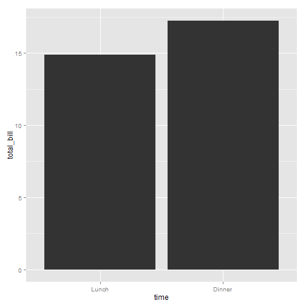 

```r
# Map the time of day to different fill colors. These both have the same result.
ggplot(data=df, aes(x=time, y=total_bill, fill=time)) + geom_bar(stat="identity")
```

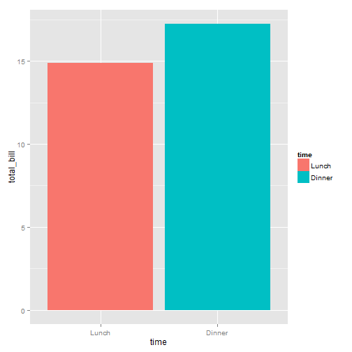 

```r
ggplot(data=df, aes(x=time, y=total_bill)) + geom_bar(aes(fill=time), stat="identity")
```

 

```r
# Add a black outline
ggplot(data=df, aes(x=time, y=total_bill, fill=time)) + geom_bar(colour="black", stat="identity")
```

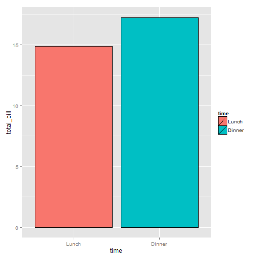 

```r
# No legend, since the information is redundant
ggplot(data=df, aes(x=time, y=total_bill, fill=time)) +
    geom_bar(colour="black", stat="identity") +
    guides(fill=FALSE)
```

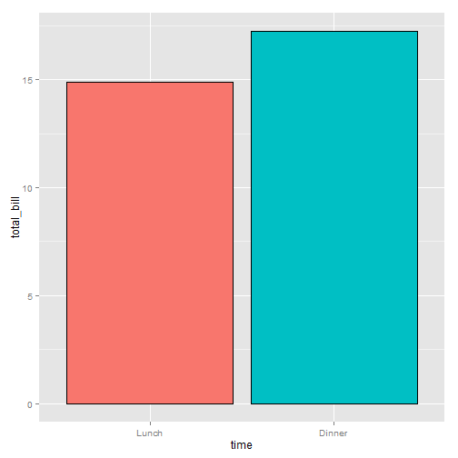 

The desired bar graph might look something like this:

```r
# Add title, narrower bars, gray fill, and change axis labels
ggplot(data=df, aes(x=time, y=total_bill, fill=time)) + 
    geom_bar(colour="black", fill="#DD8888", width=.7, stat="identity") + 
    #guides(fill=FALSE) +
    xlab("Time of day") + ylab("Total bill") +
    ggtitle("Average bill for 2 people")
```

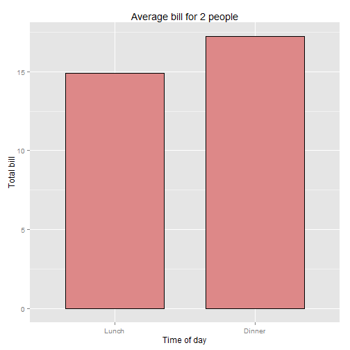 


### Bar graphs of counts
In these examples, the height of the bar will represent the count of cases. This is done by using `stat="bin"` (which is the default).
We'll start with the `tips` data from the reshape2 package:

```r
library(reshape2)
head(tips)
```

```
##   total_bill  tip    sex smoker day   time size
## 1      16.99 1.01 Female     No Sun Dinner    2
## 2      10.34 1.66   Male     No Sun Dinner    3
## 3      21.01 3.50   Male     No Sun Dinner    3
## 4      23.68 3.31   Male     No Sun Dinner    2
## 5      24.59 3.61 Female     No Sun Dinner    4
## 6      25.29 4.71   Male     No Sun Dinner    4
```
To get a bar graph of counts, don't map a variable to y, and use stat="bin" (which is the default):

```r
# Bar graph of counts
ggplot(data=tips, aes(x=day)) + geom_bar(stat="bin")
```

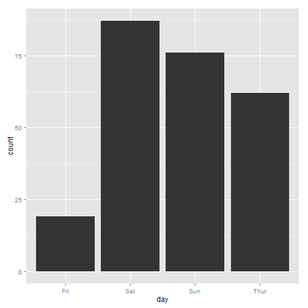 

```r
# Equivalent to this, since stat="bin" is the default:
ggplot(data=tips, aes(x=day)) + geom_bar()
```

 

### Line graphs
For line graphs, the data points must be grouped so that it knows which points to connect. In this case, it is simple -- all points should be connected, so group=1. When more variables are used and multiple lines are drawn, the grouping for lines is usually done by variable (this is seen in later examples).

```r
# Basic line graph. These both have the same result.
ggplot(data=df, aes(x=time, y=total_bill, group=1)) + geom_line()
```

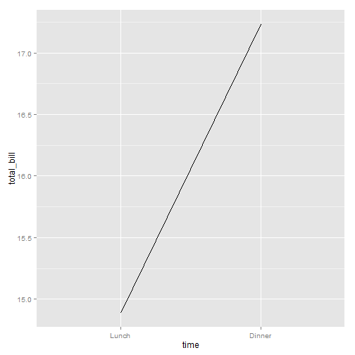 

```r
ggplot(data=df, aes(x=time, y=total_bill)) + geom_line(aes(group=1))
```

 

```r
# Add points
ggplot(data=df, aes(x=time, y=total_bill, group=1)) + geom_line() + geom_point()
```

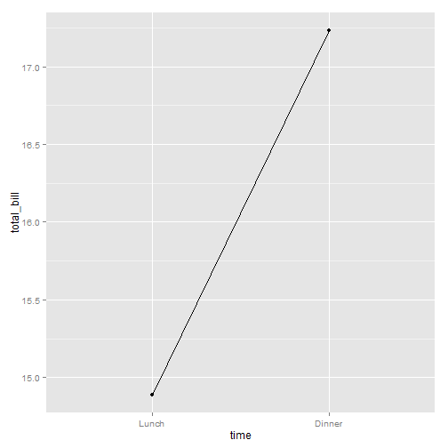 

```r
# Change color of both line and points
# Change line type and point type, and use thicker line and larger points
# Change points to circles with white fill
ggplot(data=df, aes(x=time, y=total_bill, group=1)) + 
    geom_line(colour="red", linetype="dotted", size=1.5) + 
    geom_point(colour="red", size=4, shape=21, fill="white")
```

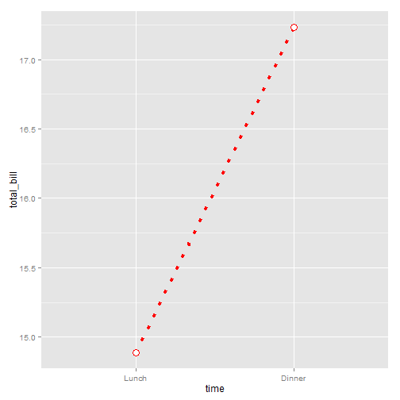 

The desired line graph might look something like this:

```r
# Change the y-range to go from 0 to the maximum value in the total_bill column,
# and change axis labels
ggplot(data=df, aes(x=time, y=total_bill, group=1)) + geom_line() + geom_point() +
    ylim(0, max(df$total_bill)) +
    xlab("Time of day") + ylab("Total bill") +
    ggtitle("Average bill for 2 people")
```

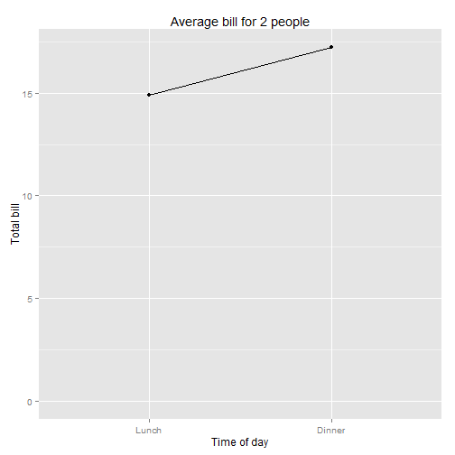 

## Graphs with more variables
Sample data uses below:

```r
df1 <- data.frame(sex = factor(c("Female","Female","Male","Male")),
                  time = factor(c("Lunch","Dinner","Lunch","Dinner"), levels=c("Lunch","Dinner")),
                  total_bill = c(13.53, 16.81, 16.24, 17.42))
df1
```

```
##      sex   time total_bill
## 1 Female  Lunch      13.53
## 2 Female Dinner      16.81
## 3   Male  Lunch      16.24
## 4   Male Dinner      17.42
```

### Bar graphs

These are the variable mappings used here:
- time: x-axis
- sex: color fill
- total_bill: y-axis.

```r
# Stacked bar graph -- this is probably not what you want
ggplot(data=df1, aes(x=time, y=total_bill, fill=sex)) + geom_bar(stat="identity")
```

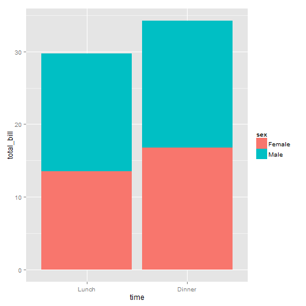 

```r
# Bar graph, time on x-axis, color fill grouped by sex -- use position_dodge()
ggplot(data=df1, aes(x=time, y=total_bill, fill=sex)) +
        geom_bar(stat="identity", position=position_dodge())
```

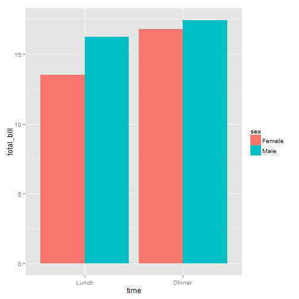 

```r
ggplot(data=df1, aes(x=time, y=total_bill, fill=sex)) +
        geom_bar(stat="identity", position=position_dodge(), colour="black")
```

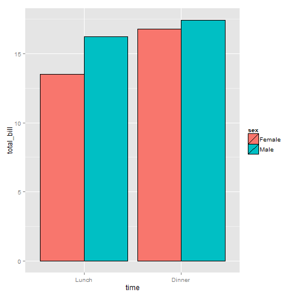 

```r
# Change colors
ggplot(data=df1, aes(x=time, y=total_bill, fill=sex)) + 
        geom_bar(stat="identity", position=position_dodge(), colour="black") +
        scale_fill_manual(values=c("#999999", "#E69F00"))
```

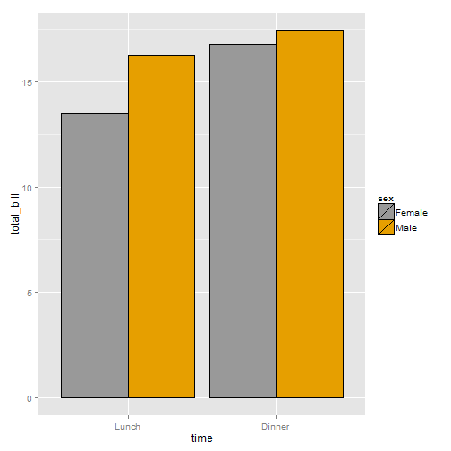 

It is easy to change which variable is mapped the x-axis and which is mapped to the fill. 

```r
# Bar graph, time on x-axis, color fill grouped by sex -- use position_dodge()
ggplot(data=df1, aes(x=sex, y=total_bill, fill=time)) +
        geom_bar(stat="identity", position=position_dodge(), colour="black")
```

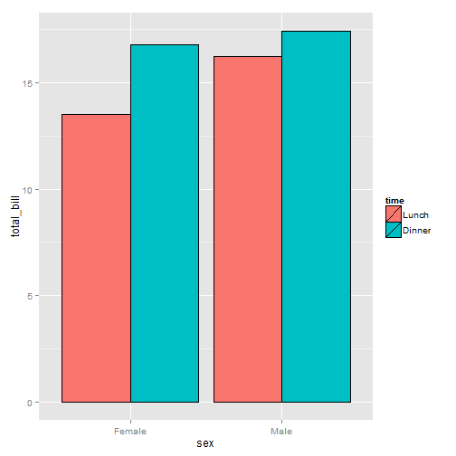 

### Line graphs
These are the variable mappings used here:
- time: x-axis
- sex: line color
- total_bill: y-axis.
To draw multiple lines, the points must be grouped by a variable; otherwise all points will be connected by a single line. In this case, we want them to be grouped by sex.

```r
# Basic line graph with points
ggplot(data=df1, aes(x=time, y=total_bill, group=sex)) + geom_line() + geom_point()
```

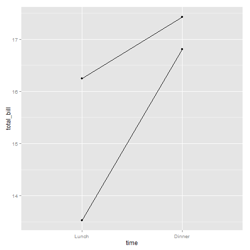 

```r
# Map sex to color
ggplot(data=df1, aes(x=time, y=total_bill, group=sex, colour=sex)) + geom_line() + geom_point()
```

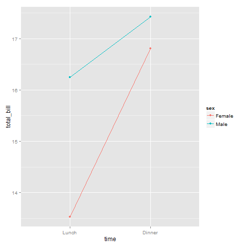 

```r
# Map sex to different point shape, and use larger points
ggplot(data=df1, aes(x=time, y=total_bill, group=sex, shape=sex)) + geom_line() + geom_point()
```

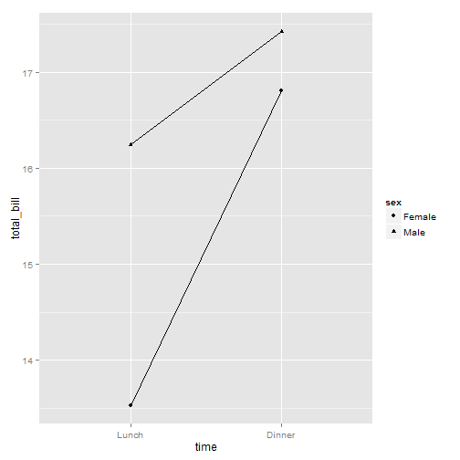 

```r
# Use thicker lines and larger points, and hollow white-filled points
ggplot(data=df1, aes(x=time, y=total_bill, group=sex, shape=sex)) + 
    geom_line(size=1.5) + 
    geom_point(size=3, fill="white") +
    scale_shape_manual(values=c(24,21))
```

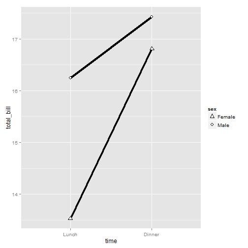 

It is easy to change which variable is mapped the x-axis and which is mapped to the color or shape. 

```r
ggplot(data=df1, aes(x=sex, y=total_bill, group=time, shape=time, color=time)) + 
        geom_line() + geom_point()
```

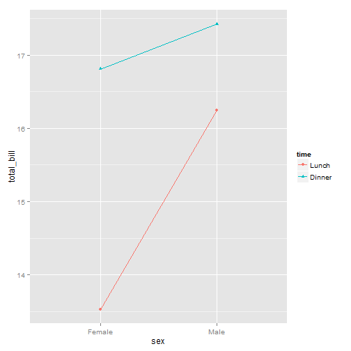 

## Finished examples
The finished graphs might look like these:

```r
# A bar graph
ggplot(data=df1, aes(x=time, y=total_bill, fill=sex)) + 
    geom_bar(colour="black", stat="identity",
             position=position_dodge(),
             size=.3) +                        # Thinner lines
    scale_fill_hue(name="Sex of payer") +      # Set legend title
    xlab("Time of day") + ylab("Total bill") + # Set axis labels
    ggtitle("Average bill for 2 people") +  # Set title
    theme_bw()
```

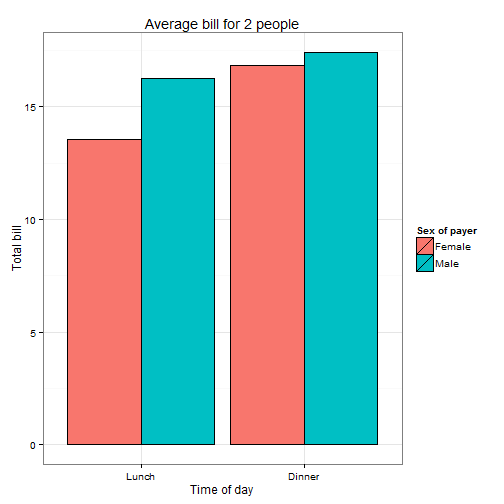 

```r
# A line graph
ggplot(data=df1, aes(x=time, y=total_bill, group=sex, shape=sex, colour=sex)) + 
    geom_line(aes(linetype=sex), size=1) +     # Set linetype by sex
    geom_point(size=3, fill="white") +         # Use larger points, fill with white
    ylim(0, max(df1$total_bill)) +             # Set y range
    scale_colour_hue(name="Sex of payer",      # Set legend title
                     l=30)  +                  # Use darker colors (lightness=30)
    scale_shape_manual(name="Sex of payer",
                       values=c(22,21)) +      # Use points with a fill color
    scale_linetype_discrete(name="Sex of payer") +
    xlab("Time of day") + ylab("Total bill") + # Set axis labels
    ggtitle("Average bill for 2 people") +  # Set title
    theme_bw() +
    theme(legend.position=c(.7, .4)) # Position legend inside
```

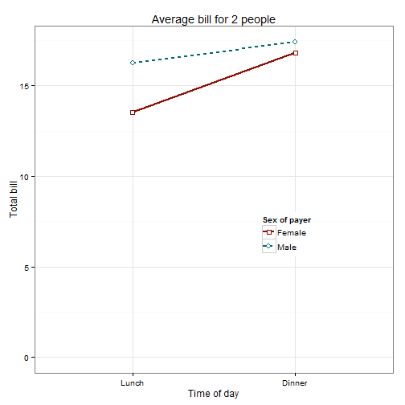 

```r
                                    # This must go after theme_bw
```

